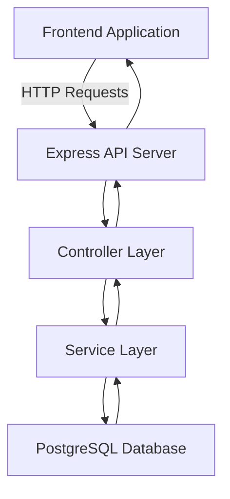

# E-Shop E-commerce API

Welcome to the E-Shop E-commerce API! This API serves as the backend for a fictional e-commerce application. It provides endpoints for managing products, orders, and user accounts, and enables a front-end application to display a catalog of items, manage a shopping cart, and handle user interactions.


## Features

- **Product Management**: Add, update, delete, and fetch products.
- **User Management**: Register, authenticate, and manage users.
- **Order Management**: Create orders, view order history, and handle order statuses.
- **Image Integration**: Each product includes a placeholder image.

## Architecture Overview

The application is built with the following stack:

- **Backend**: Node.js with Express for the REST API.
- **Database**: PostgreSQL for data persistence.
- **Frontend**: React.js (or any other client consuming the API).
- **ORM**: Sequelize (or another ORM if preferred) to interact with PostgreSQL.

### Project Structure

```
├── src
│   ├── controllers      # API route controllers
│   ├── models           # Database models
│   ├── routes           # API routes
│   ├── services         # Business logic and services
│   ├── config           # Configuration files
│   └── utils            # Utility functions
└── README.md
```

### Architecture Diagram

Here's a high-level overview of the architecture in Mermaid format:



- **Frontend Application**: The React.js client or any other front-end framework that makes HTTP requests to the API server.
- **Express API Server**: The main server where API endpoints are defined. It handles HTTP requests and directs them to appropriate controllers.
- **Controller Layer**: Contains logic to handle HTTP requests, validates inputs, and calls service methods.
- **Service Layer**: Handles the business logic of the application and communicates with the database.
- **PostgreSQL Database**: Stores all persistent data, including products, users, and orders.

## Installation

1. **Clone the repository**:
   ```bash
   git clone git@github.com:tigerokuma/e-commerce-api.git
   cd e-commerce-api
   ```

2. **Install dependencies**:
   ```bash
   npm install
   ```

3. **Configure Environment Variables**: Create a `.env` file with the necessary environment variables, including database connection details.

4. **Run the Database Migration**:
   ```bash
   npm run migrate
   ```

5. **Start the Server**:
   ```bash
   npm start
   ```

## Usage

### API Endpoints

#### Products

- `GET /api/products` - Retrieve all products
- `GET /api/products/:id` - Retrieve a product by ID
- `POST /api/products` - Add a new product
- `PUT /api/products/:id` - Update a product by ID
- `DELETE /api/products/:id` - Delete a product by ID

#### Users

- `POST /api/users/register` - Register a new user
- `POST /api/users/login` - Login for existing users

#### Orders

- `POST /api/orders` - Place an order
- `GET /api/orders/:userId` - Get orders for a specific user

## Sample Data

To seed the database with sample data, run:

```bash
node seedDatabase.js
```

## Future Improvements

- **Authentication**: Implement JWT-based authentication.
- **Search and Filter**: Add product search and filtering functionality.
- **Order History**: Enable users to view order histories and order statuses.

## License

This project is licensed under the MIT License.
